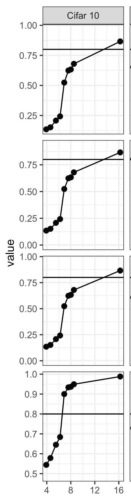

# Why Simple Models Almost Always Work Best: Non-Technical Explainer

Our paper has some technical elements, though the underlying ideas are straightforward. Here we give a non-technical account of our claims and our evidence for those claims.  The intended audience is one of social scientists who are potentially unfamiliar with recent developments in machine learning---especially "deep learning". Below each section you will find a "too long, didn't read" summary. 

## 1. Machine Learning and Prediction

Suppose you wanted to predict conflict between nations, or the winner of a general election, or the outcomes for children in the state social welfare system.  How would you do it?  First, let's be clear about what we mean by *predict*.  What we care about is good *forecasts*: you give me a bunch of conditions---values of variables (the *X*s)---and I tell you what will happen to the outcome (*Y*).  For instance, you tell me the state of the economy (*X*1), how popular the candidates are (*X*2), whether there are incumbents running (*X*3) and so on...and I tell you who will win (*Y*). Importantly, we are not trying to *explain* how candidates win votes with some theoretical model of the world which we then take to data.  We are just trying to do the best job we can---the most *accurate* job we can---of saying what will happen. So, for example, we don't think that one poll has a *causal* effect on another poll a month later.  But that earlier poll is probably *informative* about what will happen in that later poll and then in the election itself.

What methods would we used to *produce* the prediction?  The answer over the past 50 years or so has been *machine learning*.  Exactly what we mean by "machine learning" depends on the field and the problem, but the basic idea is to *automate* some of the model-building and model-fitting we would otherwise do by hand.  To be more specific, we are interested here in *supervised learning*. This is the situation where we ``train" a model based on pre-existing examples of a phenomenon---their inputs (the *X*s) and their outcomes (the *Y*s).  The "machine"---which we say more about below---will hopefully learn how the inputs are related to the outcomes.  The key, and the reason we use supervised learning, is because it can try all sorts of possible relationships between *X* and *Y* that we might never have thought of or imagined.  

That is, rather than us saying "try a model where the incumbent wins if the unemployment rate is low enough, and the GDP growth is high enough, and the US is not involved in any foreign wars", our supervised approach will try *that* model, and millions of other such models that all vary from each other.  That variation comes from different functions it is using to combine the variables, including multiplying them by each other, squaring them, cubing them and so on. And it will do all this *automatically* and in a way that optimizes the correctness of its predictions. You can get a sense of these combinations from the figure which shows a "neural network": the *X* variables enter on the left hand side and lots of different combinations are tried such that we can predict the target of our inquiry (the *Y*). 
 
We can evaluate how well the machine has done by checking its accuracy on a set of data we kept back from the set of observations we let it use to learn the relationship between *X* and *Y*. For that ``held out" data, we give it the value of the inputs and ask for its best guess of the outcomes (*Y*)---which we know, but that do not show it.  If it does well enough on that *test set* of data, we can deploy it in the real world.  

So, for example, we might train an election predicting model on US presidential elections from the following post-war years: 1948, 1956, 1964, ... ,2012, 2020. That is, every second election.  The machine will consider all the variables we have at hand---the prevailing unemployment rate, the inflation rate of the election year, the Fed interest rate etc. It will use them to predict what happened in those elections---say, ``did the Democrat win?".  Then we see how well that model performs on our *test* set: the *X*s and *Y*s for 1952, 1960, 1968, ..., 2008, 2016.  If we think it looks accurate enough, we plug in the *X*s for 2024, and see what it predicts. 
 
Different researchers will use different machines that combine the data in different ways and thus they will have different predictions, but we can judge them by seeing which is closest to the truth---for example, one of the Global Warming Projections in the figure will be better than the others. 

**tl;dr: machine learning is about prediction. Machine learning models can automatically try all sorts of relationships between inputs and outcomes in an effort to forecast well---these include models we would never have thought of**

## 2. Prediction in Political Science

How is this working out?  Thinking broadly, machine learning has revolutionized science. We see it everywhere: from image analysis to geology to medicine to physics.  A special class of complicated models called (neural) nets has been particularly successful, and a related field of "[deep learning](https://www.nature.com/articles/nature14539)" has grown up around them. Many of the breakthroughs we see today in "Artificial Intelligence" and "Large Language Models" are based on those techniques.

What about in political science?  Here the news is less positive.  There have been many papers that use "machine learning" but it is typically in an *unsupervised* setting, like topic models.  There the researcher believes there is some hidden structure in the data---say, documents---and the machine tries to find that structure.  It is then the researcher's job to say what that structure is, exactly---what the clusters represent, or what the dimensions of debate are.  The goal is not *prediction* of anything.  

Where political and other social scientists *have* used machine learning for prediction, the results have been mixed. This is perhaps best exemplified in a 2020 paper by [Salganik et al](https://www.pnas.org/doi/10.1073/pnas.1915006117).  For that paper, many different teams tried to predict life outcomes for children in a large data set.  Two results stood out: 

1. none of the predictions were very good. That is, none of the teams were able to predict what *actually* happened to the children very well. 
2. no one could beat simple models. That is, despite lots of fancy machine learning models being tried, simple approaches like linear regression or logistic regression did best.

This is surprising: we would imagine that the process by which children move through their lives and have various good or bad outcomes is very complicated.  So we would expect models that can cope with potentially very complicated processes would do well---or at least better than simple models. But this general pattern---best predictions aren't very accurate, and simple models do just as well---turns up in lots of political science papers.  The puzzle is *why*.  

**tl:dr: machine learning has been applied to complex political and social processes, but it has struggled: models are often not very accurate, and very simple models often do as well as very complicated ones.**

## 3. Intrinsic Dimension of Political Science Data is Low

Our argument is that political science data has low **intrinsic dimension**.  Basically this means that political science datasets do not have the kind of subtle variation and non-linearities that machine learning models can take advantage of over and above simple models.  This does **not** mean that politics is a simple process: rather, the data *as it arrives to us as researchers* is simple in structure.  

### Reducible Problems 
To see the problem, let's return to  predicting an election.  This might be a complicated problem because the way a particular type of person votes may depend on their demographic characteristics, plus their economic situation, plus whether they were in a good mood on election day due to the weather etc.  A machine learning model could in principle try many many combinations of these variables, including interactions ("this 45 year old Princeton professor is more likely to vote for the incumbent if the sun is shining, but this 44 year old NYU one is not").  You would need a lot of *parameters* (like the <em>&beta;</em>s in a regression)---one for Princeton, one for professor, one for good weather, one for Princeton-professor, one for  Princeton-professor-weather etc etc.  But that's ok, because we're using machine learning. But our point is that a lot of political science data does **not** have this sort of high quality, fine grained data to which to fit these many parameters.  So it doesn't make much difference whether you use a complex model or not.  Another way to express the problem is that political science modeling problems are highly **reducible**.  This means that they may initially look very complicated, but in practice you don't need much information to do a pretty good job of predicting what you are trying to predict. 

An example of this phenomenon would be something like predicting the outcome of a UK House of Commons vote in the 1950s. 
 
There were around 650 members of parliament, and they were almost all either in the Labour party or the Conservative party (see the picture where each dot is a seat after the 1955 election). One of those parties (always) formed the Government, and one of them  (always) formed the Opposition.  Whichever way the government voted, the opposition voted against. Suppose you were trying to predict whether a given bill would pass the House.  What would you need to know?  We might initially think we need the "ideal points" of all the 650 MPs, and where they lie relative to what the bill proposes.  But you don't: you only need to know how the leader of the Government is voting, and perhaps the leader of the Opposition.  Once you know that, you know how everyone in the governing party, and the chamber, will vote.  So we *reduced* a problem of needing 650 parameters down to one of needing only 2.  And we were able to do this because there was much more strucure in the data than it initially appeared. 

### Finding the Intrinsic Dimension

How can we know exactly what the intrinsic dimension of a dataset is?  The basic idea is to fit a very complicated model with lots of parameters (looking for lots of 'effects'), and then try a model with fewer parameters (looking for fewer 'effects'), and keep reducing the number.  When you get to a low enough parameter number that the model starts fiting poorly---meaning it doesn't predict very well relative to the model with many many parameters, you have found the intrinsic dimension.  Unsurprisingly, the details are more technical than this, and involve something called **random subspace training** invented by [Li et al (2018)](https://arxiv.org/abs/1804.08838). And in practice, one fits arbirtarily complex model called a [deep neural network](https://news.mit.edu/2017/explained-neural-networks-deep-learning-0414) to predict the outcome.  As we mentioned above, these models combine the variables available to them in complex ways that make for accurate predictions in many fields.  Importantly, we can compare across models with different numbers of parameters easily: for instance, a model with 100000 parameters is "twice" as complex as one with 5000, which is "twice" as complex as one with 2500 and so on. 

### CIFAR as a Baseline

So what do we see? Well first, we need a baseline to compare results to.  We use the [CIFAR-10](https://www.cs.toronto.edu/~kriz/cifar.html) dataset for that.  This is a 60000 images in 10 classes.  Those classes are things like airplanes, cars, cats, dogs, horses and so on.  

The idea is to train machine learning models on 50000 of the images (their pixels), and try to correctly predict the airplanes, cars, cats, dogs etc in the test set images.  This is famous and classic problem, and we know from other work that the returns to "big" models---i.e. models with lots of parameters---tend to be excellent.   Reassuringly, that is what we found too.  We started with a deep neural net that had millions of parameters.  It scores very highly on the "usual" performance metrics like [accuracy](https://en.wikipedia.org/wiki/Evaluation_of_binary_classifiers#Single_metrics), [precision and recall](https://en.wikipedia.org/wiki/Precision_and_recall). Then we slowly "back off" the model, reducing the number of parameters available to it to fit the data.  

And the model responds as we would expect---reduced complexity reduces how well it fits, from a very high baseline down to quite poor performance (e.g. accuracy below 10%, when we make only 2500 parameters---exp(8)---or so available). The column figure to the right makes this point: from top to bottom we have accuracy, precision, recall, area under the curve.  The x-axis is the intrinsic dimension (log scale).  

### Political Science Data
What about for political science data?  Does show a similar return to complex models?  No. 

